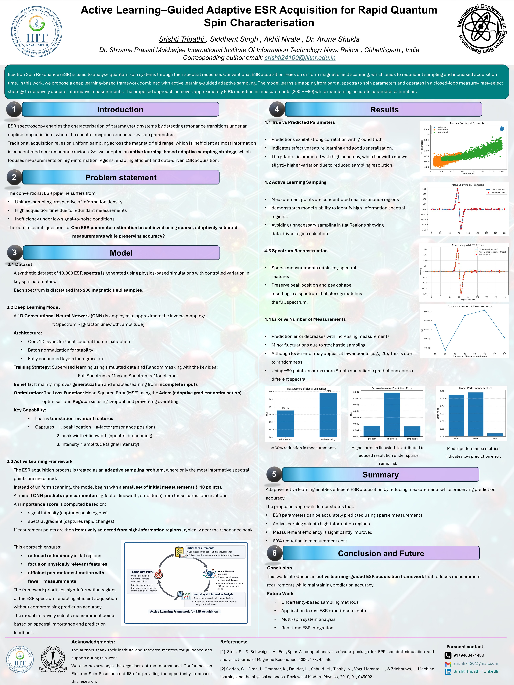

# 🧲 Active Learning–Guided Adaptive ESR Acquisition for Rapid Quantum Spin Characterisation

<div align="center">


**Presented at the International Conference on Electron Spin Resonance (ICESR 2026)**  
📍 Indian Institute of Science, Bengaluru | 📅 21–24 March 2026

</div>

---

## 👩‍💻 Authors

**Srishti Tripathi** · Siddhant Singh · Akhil Nirala · Dr. Aruna Shukla  
Dr. Shyama Prasad Mukherjee International Institute of Information Technology, Naya Raipur, India  
📧 srishti24100@iiitnr.edu.in

---
## 📄 Conference Poster

<p align="center">
  
</p>

## 📌 Overview

This project introduces an **active learning–guided adaptive ESR acquisition framework** that dramatically reduces the number of measurements needed to characterise quantum spin systems — without sacrificing accuracy.

Instead of conventional uniform magnetic-field scanning (which wastes time on uninformative regions), our closed-loop system:

1. Takes a small initial set of measurements
2. Trains a **1D CNN** to predict spin parameters from partial spectra
3. Uses an **importance-score acquisition policy** to select only the most informative next measurement points
4. Iterates until reliable spin characterisation is achieved

> **Key result: ~60% reduction in required measurements** while maintaining accurate estimation of g-factor, linewidth, and amplitude.

---

## 🧪 Background: What is ESR?

Electron Spin Resonance (ESR) is a quantum spectroscopy technique used to probe systems with unpaired electrons. It encodes key spin parameters — **g-factor** (resonance position), **linewidth** (spectral broadening), and **amplitude** (signal intensity) — in the spectral response to a swept magnetic field.

Conventional ESR acquires data at 200+ uniformly spaced field points. This project asks: **can we achieve the same accuracy with ~80 points, selected intelligently?**

---

## 🏗️ Architecture

```
Full Spectrum (200 pts)
        │
  Random Masking ──► Masked Spectrum (10–80 pts kept)
        │
  StandardScaler
        │
   ┌────▼────────────────────────────┐
   │     1D CNN Feature Extractor    │
   │  Conv1D(64) → BN → MaxPool     │
   │  Conv1D(128) → BN → MaxPool    │
   │  Flatten                        │
   │  Dense(128) → Dropout(0.3)     │
   │  Dense(64)                      │
   │  Dense(3) ← [g, lw, amp]       │
   └─────────────────────────────────┘
        │
   Spin Parameters: [g-factor, linewidth, amplitude]
        │
   Acquisition Policy
   (importance = signal intensity + spectral gradient)
        │
   Select next measurement point → repeat
```

**Loss:** Mean Squared Error (MSE)  
**Optimizer:** Adam  
**Regularisation:** Dropout + Batch Normalisation  

---

## 📊 Results

| Metric | Value |
|--------|-------|
| Measurement reduction | ~60% (200 → ~80 points) |
| g-factor MAE | Very low (high accuracy) |
| Linewidth MAE | Slightly higher (expected under sparse sampling) |
| Amplitude MAE | Low |
| Stable prediction threshold | ~80 measurement points |

- Predictions show **strong correlation with ground truth** across all three parameters
- Active learning concentrates measurements **near resonance peaks**, avoiding flat regions
- Sparse measurements retain **key spectral features** (peak position + shape)

---

## 📁 Repository Structure

```
📦 esr-active-learning-icesr2026/
├── 📓 model2.ipynb              # Full pipeline: data loading → CNN → active learning
├── 📄 abstract.pdf              # Submitted abstract (ICESR 2026)
├── 🖼️ poster.jpeg               # Conference poster (presented at IISc)
├── 🏅 certificate.jpeg          # Certificate of Participation — ICESR 2026
├── 📂 assets/
│   └── architecture.png         # (optional) model diagram
└── 📖 README.md
```

> **Note:** The dataset `esr_dataset_10000.csv` (10,000 simulated ESR spectra, 200 field points each) is not included due to file size. It can be regenerated using physics-based ESR simulation (see notebook comments).

---

## 🚀 Getting Started

### Prerequisites

```bash
Python >= 3.8
TensorFlow >= 2.10
scikit-learn
numpy
pandas
matplotlib
```

### Installation

```bash
git clone https://github.com/YOUR_USERNAME/esr-active-learning-icesr2026.git
cd esr-active-learning-icesr2026
pip install tensorflow scikit-learn numpy pandas matplotlib
```

### Run the Notebook

```bash
jupyter notebook model2.ipynb
```

Make sure `esr_dataset_10000.csv` is in the same directory, or update the path in cell 2.

---

## 🔬 Dataset

- **10,000 synthetic ESR spectra** generated using physics-based simulations
- Each spectrum: **200 magnetic field samples**
- Labels: `[g-factor, linewidth, amplitude]`
- Training masking: random 10–80 points retained per spectrum (simulates sparse acquisition)
- Train/test split: 80/20

---

## 🧠 Key Innovations

**Random Masking for Robustness** — The model is trained on randomly masked spectra (keeping only 10–80 of 200 points), forcing it to learn from incomplete data and generalise to any sampling pattern.

**Importance-Score Acquisition** — At inference time, the next measurement point is selected based on:
- Signal intensity (captures peak regions)
- Spectral gradient (captures rapid changes)

**Closed-Loop Strategy** — Measure → Infer → Select → Repeat, reducing total scans while converging on accurate spin parameters.

---

## 📚 References

[1] Stoll, S., & Schweiger, A. EasySpin: A comprehensive software package for EPR spectral simulation and analysis. *Journal of Magnetic Resonance*, 2006, 178, 42–55.

[2] Carleo, G., Cirac, I., Cranmer, K., et al. Machine learning and the physical sciences. *Reviews of Modern Physics*, 2019, 91, 045002.

---

## 🏆 Recognition

- ✅ **Accepted for Poster Presentation** at ICESR 2026
- 🎓 Presented at the **Indian Institute of Science, Bengaluru**
- 📜 Certificate of Participation issued by ICESR 2026

---

## 📬 Contact

**Srishti Tripathi**  
B.Tech CSE · IIIT Naya Raipur  
📧 srishti24100@iiitnr.edu.in  
🔗 [LinkedIn](https://linkedin.com/in/srishti-tripathi) · [GitHub](https://github.com/YOUR_USERNAME)

---

<div align="center">
<sub>Made with ❤️ at IIIT Naya Raipur | ICESR 2026 · IISc Bengaluru</sub>
</div>
